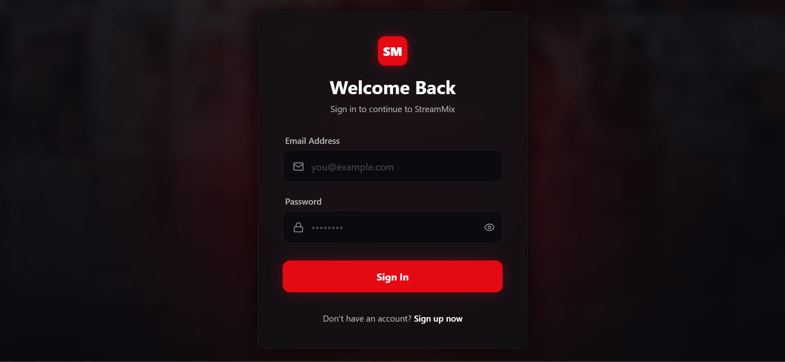
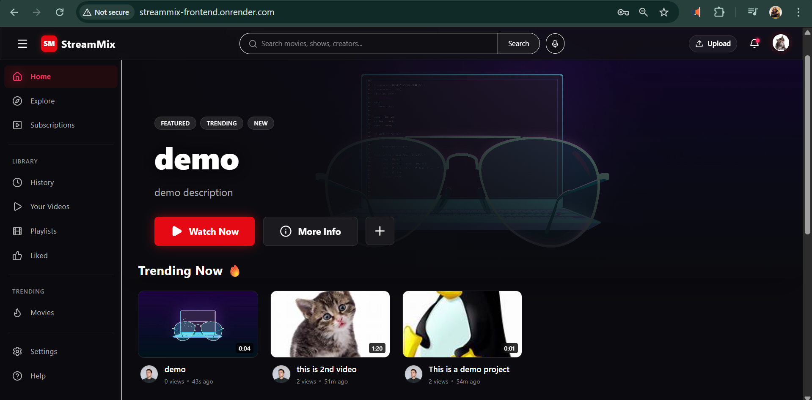
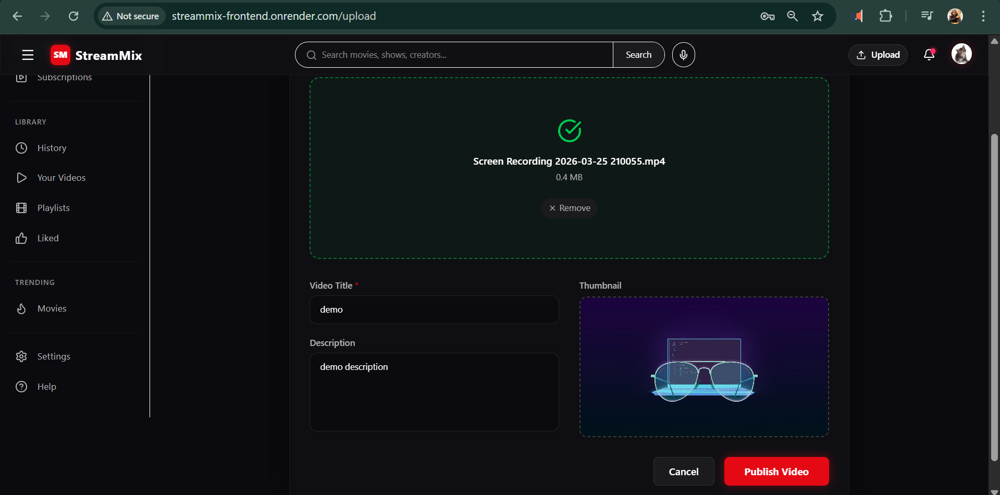
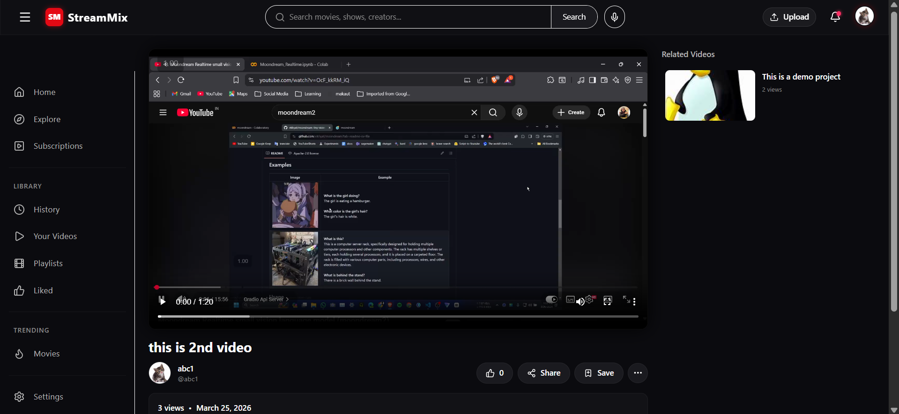
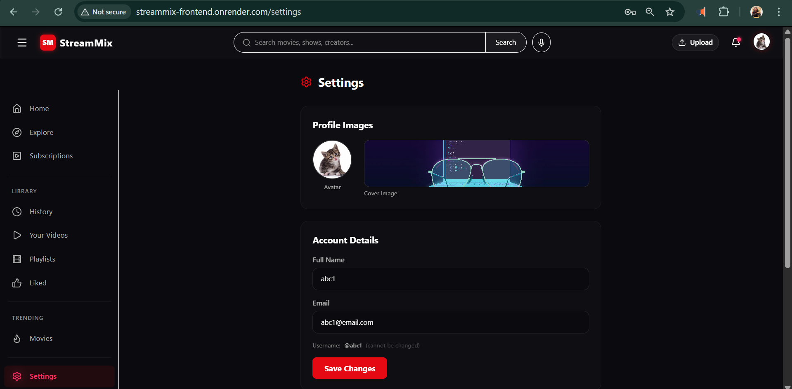

# 🎬 StreamMix  
### A Full-Stack Video Streaming Platform 

StreamMix is a scalable full-stack video streaming platform that allows users to upload, stream, and interact with video content. Built with modern web technologies, it replicates core functionalities of platforms like YouTube and Netflix, including user authentication, subscriptions, playlists, and real-time engagement.

---

## 🚀 Demo / Preview

🌐 **Live Website:** https://streammix-frontend.onrender.com  
📽️ **YouTube Demo:** https://youtu.be/c0t7Z1ThtsM  

---

## ✨ Features

### 🎨 Frontend Features
- Modern Netflix-inspired UI/UX
- Responsive design (Mobile + Desktop)
- Video browsing homepage
- Watch video page with player
- Search functionality
- Channel pages with subscriptions
- User profile & dashboard
- Playlist management
- Like & comment system
- Seamless navigation using React Router

---

### ⚙️ Backend Features

#### 👤 User Management
- Register / Login / Logout
- JWT Authentication (Access + Refresh Tokens)
- Profile management (avatar, cover image)
- Watch history tracking

#### 🎥 Video Management
- Upload videos (Cloudinary integration)
- Fetch all videos
- Get video by ID
- Update / Delete video
- Publish / Unpublish video

#### 💬 Comments
- Add / Edit / Delete comments
- Fetch comments per video

#### ❤️ Likes
- Like / Unlike videos
- Like comments
- Fetch liked videos

#### 📂 Playlists
- Create playlists
- Add / Remove videos
- Update / Delete playlists

#### 📡 Subscriptions
- Subscribe / Unsubscribe channels
- Get subscribers list
- Get subscribed channels

#### 📊 Dashboard
- Channel statistics
- Uploaded videos overview

---

## 🛠️ Tech Stack

### Frontend
- ⚛️ React.js
- 🎨 Tailwind CSS
- 🔗 Axios
- 🌐 React Router

### Backend
- 🟢 Node.js
- 🚀 Express.js
- 🍃 MongoDB (Mongoose)

### Other Tools & Services
- ☁️ Cloudinary (Media Storage)
- 🔐 JWT Authentication
- 📁 Multer (File Uploads)

---

##  System Architecture Overview

StreamMix follows a **client-server architecture**:


- **Frontend** handles UI and API communication  
- **Backend** manages business logic, authentication, and APIs  
- **MongoDB** stores user data, videos metadata, etc.  
- **Cloudinary** handles video/image storage  

---

## Full Project Structure
```bash
streammix/
├── backend/
│   ├── controllers/
│   ├── models/
│   ├── routes/
│   ├── middlewares/
│   ├── utils/
│   ├── config/
│   ├── app.js
│   ├── server.js
│
├── frontend/
│   ├── src/
│   │   ├── components/
│   │   ├── pages/
│   │   ├── hooks/
│   │   ├── services/
│   │   ├── context/
│   │   ├── utils/
│   │   ├── App.jsx
│   │   ├── main.jsx
│   ├── public/
│
├── README.md
├── package.json
│
├── Docs/
│   ├── PRD.md
│   ├── USER_FLOW.md
│   ├── DESIGN.md
│   ├── TECH_STACK.md
│   ├── DATABASE.md
│   ├── API_SPEC.md
│   └── ROADMAP.md

```

---

## ⚡ Installation & Setup

### 1️⃣ Clone the Repository

```bash
git clone https://github.com/your-username/streammix.git
cd streammix
```

### 2️⃣ Backend Setup
```bash
cd BACKEND
npm install
```

#### Create .env file:
```bash
PORT=8000
MONGO_URI=your_mongodb_connection_string
JWT_SECRET=your_jwt_secret
JWT_REFRESH_SECRET=your_refresh_secret

CLOUDINARY_CLOUD_NAME=your_cloud_name
CLOUDINARY_API_KEY=your_api_key
CLOUDINARY_API_SECRET=your_api_secret
```

#### Run Backend:
```bash
npm run dev
```

### 3️⃣ Frontend Setup
```bash
cd FRONTEND
npm install
```

#### Run Frontend:
```bash
npm run dev
```

## 🔗 API Overview
```bash
### 🔐 Auth Routes
POST   /api/auth/register
POST   /api/auth/login
POST   /api/auth/logout
### 👤 User Routes
GET    /api/users/profile
PUT    /api/users/update
GET    /api/users/history
### 🎥 Video Routes
POST   /api/videos/upload
GET    /api/videos
GET    /api/videos/:id
PUT    /api/videos/:id
DELETE /api/videos/:id
### 💬 Comments
POST   /api/comments/:videoId
GET    /api/comments/:videoId
PUT    /api/comments/:id
DELETE /api/comments/:id
### ❤️ Likes
POST   /api/likes/video/:id
POST   /api/likes/comment/:id
GET    /api/likes/videos
### 📂 Playlists
POST   /api/playlists
GET    /api/playlists
PUT    /api/playlists/:id
DELETE /api/playlists/:id
### 📡 Subscriptions
POST   /api/subscriptions/:channelId
GET    /api/subscriptions
```

---

## 📸 Screenshots Section 


### Login


### Homepage


### Uploading


### Video Player Page


### Channel Page



## 🚀 Future Improvements

- 🔴 Live Streaming Feature
- 🤖 AI-based Video Recommendations
- 📊 Advanced Analytics Dashboard
- 🔔 Real-time Notifications (WebSockets)
- 📱 Progressive Web App (PWA)
- 🌍 Multi-language Support

## 🤝 Contributing

Contributions are welcome!

1. Fork the repository  
2. Create a new branch  
   ```bash
   git checkout -b feature/your-feature
   ```
3. Commit your changes
4. Push to your branch
5. Open a Pull Request

## 👨‍💻 Author

**Dibyanand Mishra**

## 🌐 Connect with Me

[](https://github.com/Dibyanandmishra)

[](https://www.linkedin.com/in/dibya-nand-mishra-84865a301/)

[](https://x.com/nand_dibya51757)

## ⭐ Show Your Support

If you like this project, consider giving it a ⭐ on GitHub and sharing it with others!

